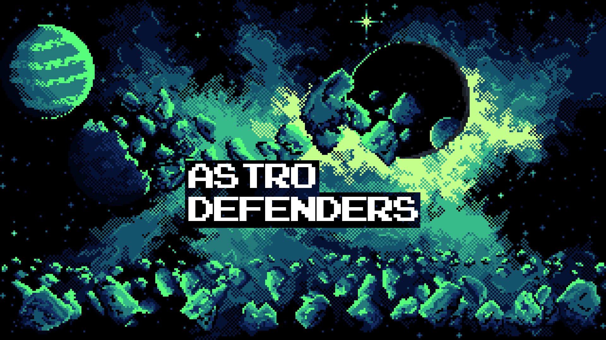
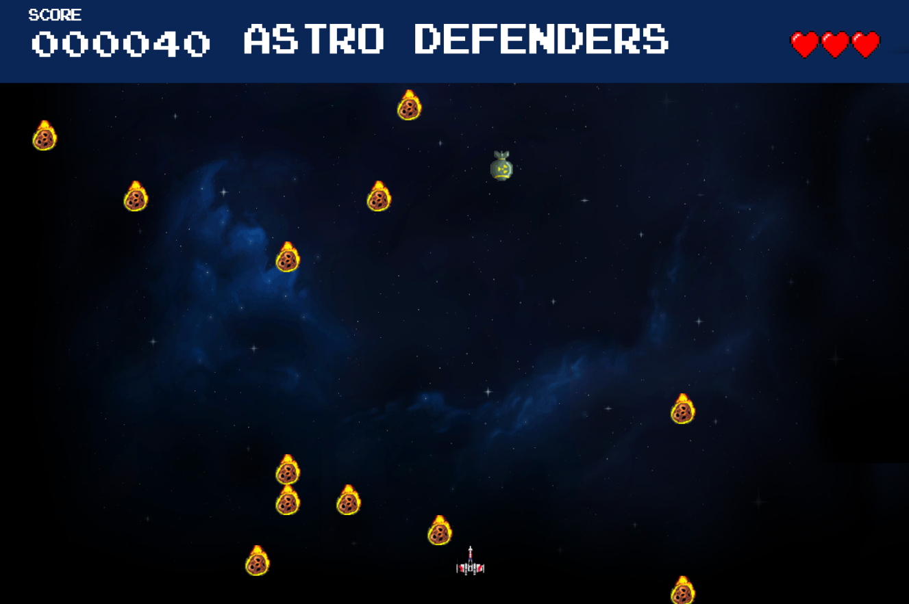

# Astro Defenders 🚀

## Equipo de desarrollo 👨‍💻👩‍💻

- Valentin Bravo
- Lucio De Goñi
- Gonzalo Pinto
- Bruno Rodríguez

## Capturas 📸

## Reglas de Juego / Instrucciones 🎮

- *Esquivar los meteoritos*: La nave debe evitar los meteoritos que aparecen en el espacio 🌠.
- *Utilizar las flechas para moverse*: Las flechas de dirección ➡⬅ permiten mover la nave de izquierda a derecha.
- *Espacio para disparar*: Presiona la tecla espacio ⏺ para disparar a los meteoritos. Existe la posibilidad de destruirlos al acertar un disparo.
- *Recolectar corazones*: Los corazones ❤ sirven para recuperar vida. Asegúrate de recolectarlos para poder sobrevivir más tiempo.
- *Enfrentar al jefe final*: Una vez que hayas recolectado las llaves 🔑, podrás enfrentarte al jefe final 👾 para salvar la galaxia.

## Lore 🌌

El universo está en peligro. Una imparable lluvia de meteoritos 🌠 amenaza con destruir todos los sistemas planetarios. En un rincón lejano de la galaxia, un héroe solitario conocido como *el Defensor del Cosmos* debe embarcarse en una misión peligrosa para salvar el universo.

Tu nave 🚀 ha sido equipada con la última tecnología, pero necesitarás reflejos rápidos y una puntería precisa para evitar los meteoritos y recoger las llaves esparcidas por el espacio. Estas llaves son la clave para desbloquear el acceso al jefe final 👾, una criatura cósmica que controla la tormenta de meteoritos y cuya derrota es la única forma de restaurar la paz.

Mientras navegas a través del campo de meteoritos 🌠, no solo tendrás que esquivar las rocas que se cruzan en tu camino, sino también recuperar la vitalidad perdida al recolectar los corazones ❤ dispersos. Con cada disparo 💥, aumenta la esperanza de que puedas destruir los meteoritos antes de que te alcancen. Solo con habilidad y perseverancia podrás superar los desafíos y enfrentarte al jefe final para salvar la galaxia 🌌.

¿Tienes lo que se necesita para sobrevivir a este caos espacial? La suerte de la galaxia está en tus manos.

## Otros 🔧

- Curso/Facultad UTN 🎓
- Una vez terminado, no tenemos problemas en que el repositorio sea público 🌍
